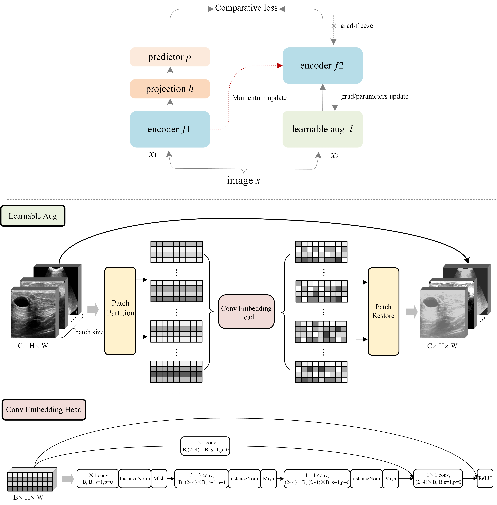

# Capturing Data’s Own Aspect: A Novel Self-Augmented Unsupervised Learning Paradigm for Medical Images Latent Representation

## CODA / CDOA+ for Self-supervised on Ultrasound muti-task dataset(UMTD)
**[Capturing Data’s Own Aspect: A Novel Self-Augmented Unsupervised Learning Paradigm for Medical Images Latent Representation](https:www.baidu.com)** [[Weights and Results](https:www.biying.com)]</br>


### Introduction
This is a PyTorch implementation of CODA/CDOA+ for self-supervised on Ultrasound muti-task dataset(UMTD).


### Main Results

The results are including two parts, CDOA or CDOA+
The results of the CDOA method without any augmentation means and the CDOA+ method with the addition of the same augmentation means such as BYOL, MoCov3 can be found by [CONFIG.md]
All results are first trained by self-supervised comparison learning features and linear training evaluation based on frozen feature layers.


#### ViT-small linear classification on UMTD
<table><tbody>
<!-- START TABLE -->
<!-- TABLE HEADER -->
<th valign="center">Method</th>
<th valign="center">pretrain<br/>epochs</th>
<th valign="center">linear<br/>acc</th>
<!-- TABLE BODY -->
<tr>
<td align="center">MoCo-v3</td>
<td align="center">300</td>
<td align="center">92.62</td>
</tr>
<td align="center">CDOA</td>
<td align="center">250</td>
<td align="center">93.08</td>
</tr>
<td align="center">CDOA+</td>
<td align="center">250</td>
<td align="center">93.35</td>
</tr>
</tbody></table>

#### Swin-Tiny linear classification on UMTD
<table><tbody>
<!-- START TABLE -->
<!-- TABLE HEADER -->
<th valign="center">Method</th>
<th valign="center">pretrain<br/>epochs</th>
<th valign="center">linear<br/>acc</th>
<!-- TABLE BODY -->
<tr>
<td align="center">MoCo-v3</td>
<td align="center">300</td>
<td align="center">92.21</td>
</tr>
<td align="center">cdoa</td>
<td align="center">300</td>
<td align="center">90.36</td>
</tr>
<td align="center">cdoa+</td>
<td align="center">300</td>
<td align="center">94.56</td>
</tr>
</tbody></table>

#### CDOA and CDOA+ on UMTD

<table><tbody>
<!-- START TABLE -->
<!-- TABLE HEADER -->
<th valign="center">Method</th>
<th valign="center">backbone</th>
<th valign="center">pretrain<br/>epochs</th>
<th valign="center">linear<br/>acc</th>
<!-- TABLE BODY -->
<tr>
<td align="center">CDOA</td>
<th valign="center">RN50</th>
<td align="center">300</td>
<td align="center">83.00</td>
</tr>
<td align="center">  </td>
<th valign="center">ViT-S</th>
<td align="center">250</td>
<td align="center">93.08</td>
</tr>
<td align="center">  </td>
<th valign="center">ViT-B</th>
<td align="center">150</td>
<td align="center">92.47</td>
</tr>
<td align="center">  </td>
<th valign="center">Swin-T</th>
<td align="center">150</td>
<td align="center">90.36</td>
</tr>
<td align="center">CDOA+</td>
<th valign="center">RN50</th>
<td align="center">300</td>
<td align="center">87.17</td>
</tr>
<td align="center">  </td>
<th valign="center">ViT-S</th>
<td align="center">250</td>
<td align="center">93.35</td>
</tr>
<td align="center">  </td>
<th valign="center">ViT-B</th>
<td align="center">150</td>
<td align="center">94.25</td>
</tr>
<td align="center">  </td>
<th valign="center">Swin-T</th>
<td align="center">300</td>
<td align="center">94.56</td>
</tr>
</tbody></table>

### Usage: Preparation

Install the dataset UMTD and load the path into the code

The code has been tested with CUDA 11.7/CuDNN 8.5.0, PyTorch 1.13.1 and timm 0.6.13
### Usage: CDOA Self-supervised Pre-Training

Below are the examples for CDOA pre-training. 

#### ResNet-50 with 2-node (2-GPUs) training, batch 256 on UMTD

On the first node, run:
```
python main_cdoa.py \
  -a resnet50
  --moco-m-cos 
  --dist-url 'tcp://[your first node address]:[specified port]' \
  --multiprocessing-distributed --world-size 2 --rank 0 \
```
On the second node, run the same command with `--rank 1`.
With a batch size of 256, the training can fit into 2 nodes with a total of 2 RTX 3090 24G GPUs. 


#### ViT-Small with 1-node (2-GPU) training, batch 256 on UMTD

```
python main_cdoa.py \
  -a vit_small -b 256 \
  --optimizer=adamw --lr=1.5e-4 --weight-decay=.1 \
  --epochs=250 --warmup-epochs=40 \
  --stop-grad-conv1 --moco-m-cos --moco-t=.5 \
  --dist-url 'tcp://localhost:10001' \
  --multiprocessing-distributed --world-size 1 --rank 0 \
```

#### Swin-Tiny with 1-node (2-GPU) training, batch 256 on UMTD

```
python main_cdoa.py \
  -a swin_t \
  --optimizer=adamw --lr=1.5e-4 --weight-decay=.1 \
  --epochs=300 --warmup-epochs=40 \
  --stop-grad-conv1 --moco-m-cos --moco-t=.5 \
  --dist-url 'tcp://localhost:10001' \
  --multiprocessing-distributed --world-size 1 --rank 0 \
```

### Usage: CDOA+ Self-supervised Pre-Training

If using CDOA+ you will need to release the code for the augmentation section in ```main_cdoa.py``` and then just run it as per the CDOA method section.


### Usage: Linear Classification

By default, we use momentum-SGD and a batch size of 256 for linear classification on frozen features/weights. This can be done with a single 2-GPU node.

```
python main_lincls.py \
  -a [architecture] --lr 0.03 \
  --dist-url 'tcp://localhost:10001' \
  --multiprocessing-distributed --world-size 1 --rank 0 \
  --pretrained [your checkpoint path]/[your checkpoint file].pth.tar \
```

### Model Configs

See the commands listed in [CONFIG.md] for specific model configs, including our recommended hyper-parameters and pre-trained reference models.

### License
We are grateful to He et al. for their clear code writing on [MoCo-v3](https://arxiv.org/abs/2104.02057), on which the CODA/ CODA+ method was developed on medical images analysis.
This project is under the CC-BY-NC 4.0 license. See [LICENSE](LICENSE) for details.

### Citation

None
